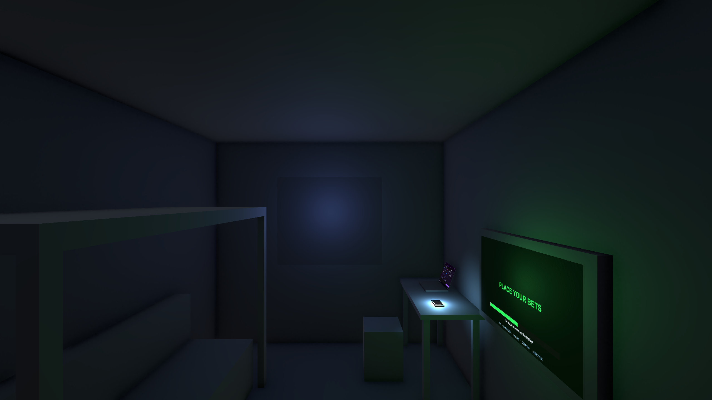
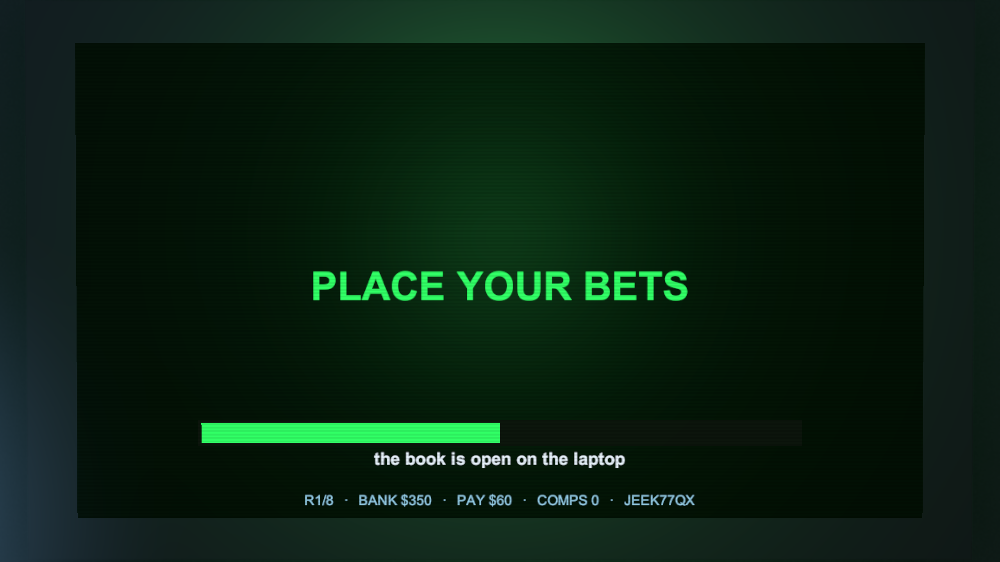
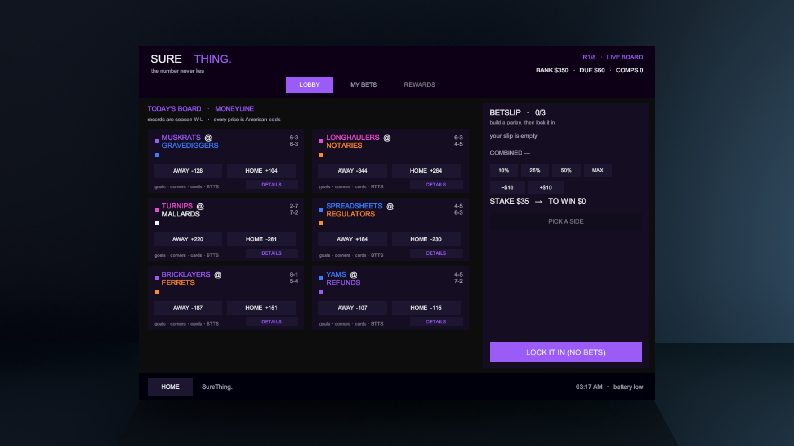
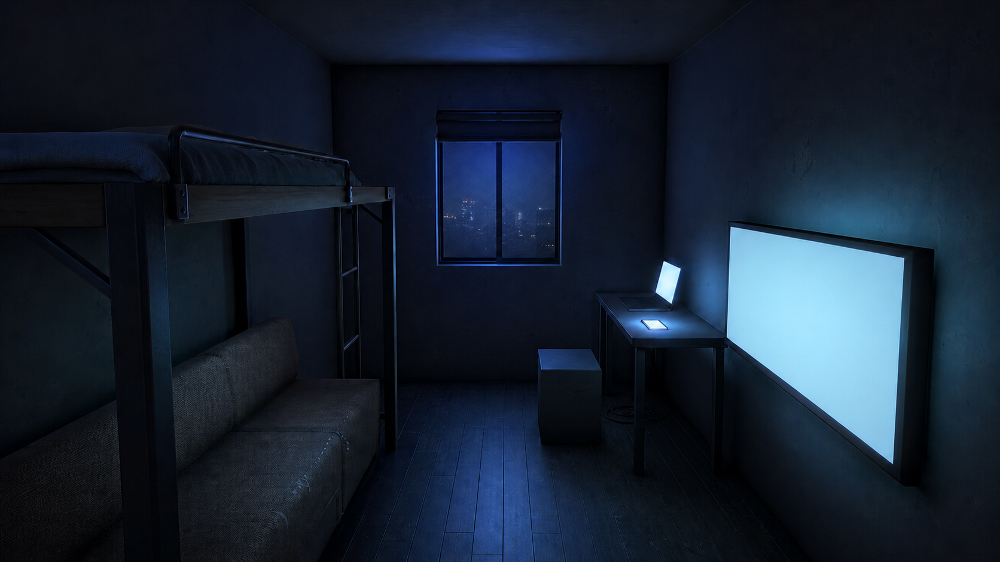
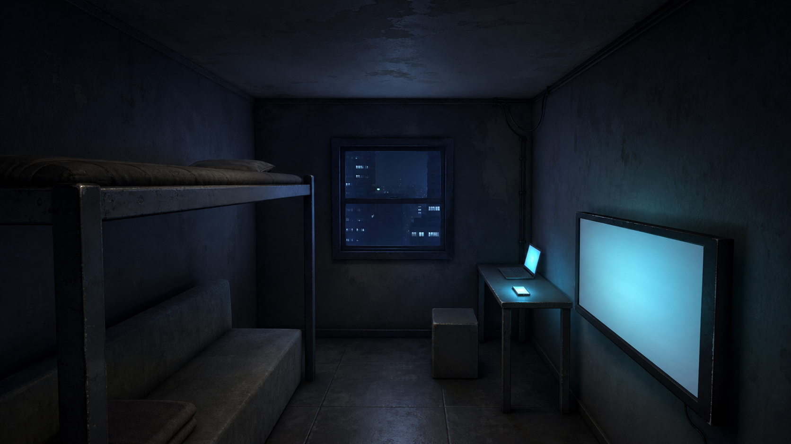
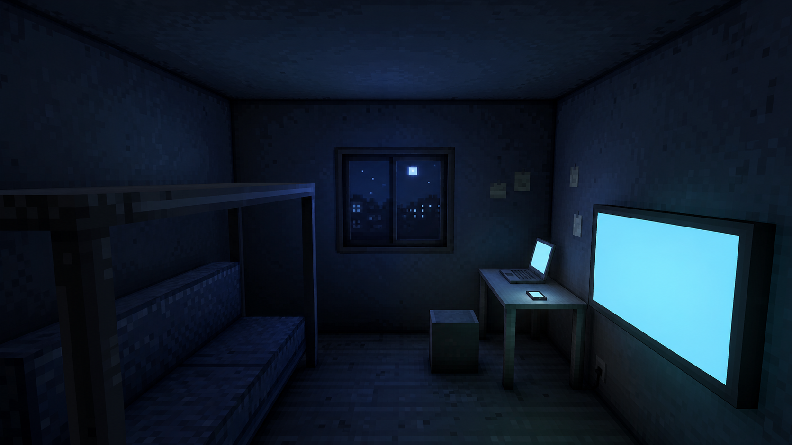
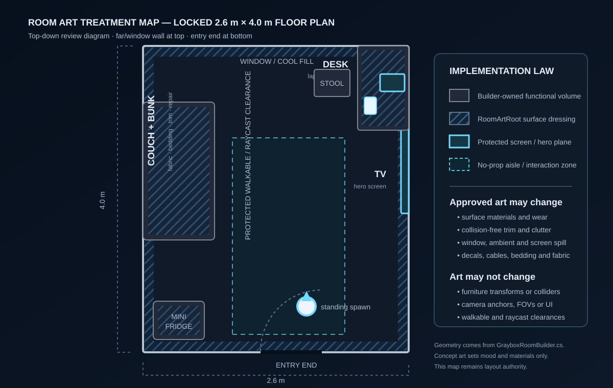

# Room Visual Pass — Sign-off Board

**Status:** REVIEW REQUIRED  
**Implementation status:** not started  
**Decision owner:** Allen  
**Recommended direction:** A — Blue-Hour Pressure  

This board turns the PRD into one approval decision. The generated images are visual-development references only; the exact Unity captures and treatment map remain authoritative for geometry, cameras, screen bounds, and walkable clearances.

## 1. Exact current-room evidence

| Standing overview — 68° | Seated TV/couch — 17° | Focused laptop/desk — 30° |
|---|---|---|
|  |  |  |

These are 2560×1440 runtime renders from the existing PlayerCamera and serialized anchors. They establish the non-negotiable compositions:

- standing: bunk-over-couch left, TV right, desk/laptop/phone far right, stool ahead, clear aisle;
- seated: the TV and slim bezel intentionally fill almost the entire frame;
- desk: the laptop UI and slim chassis intentionally fill almost the entire frame.

## 2. Three concept directions

### A — Blue-Hour Pressure (recommended)

The believable, intimate version. Worn painted walls, inexpensive dark floor, compressed woven couch, powder-coated bunk, cool window fill, and controlled cyan/white screen spill. The concept’s initially misplaced fridge was rejected and removed; the real mini-fridge remains at the entry-left location shown in the treatment map.

**Unity translation:** authored PBR-lite room materials, selective decals, inexpensive fabric/bedding, cable routing, restrained paper clutter, window/blind silhouette, and tuned cool fill.

**Why this is recommended:** it best matches the existing art-direction law, preserves sharp screens, has the lowest implementation risk, and can support later room-state variants without committing the whole project to a specialty shader.

### B — Tactile Pressure Box

The more forceful roguelite identity. Chunkier silhouettes, harsher contact shadows, exposed cable routing, rough wall/ceiling breakup, heavier bezels, and faster light falloff. It adapts the requested compressed, tactile pressure qualities without copying another game’s assets, slot imagery, branding, palette, or exact room design.

**Unity translation:** low-poly silhouette refinement, rougher material masks, stronger localized grime, exaggerated edge wear, thicker trim, cable bundles, and tighter light falloff.

**Primary guardrail:** keep it an apartment, not a prison or supernatural horror cell.

### C — Pixel Night

The strongest authored stylization. Deliberate low-resolution textures, consistent texel density, chunky geometry, posterized shadow ramps, and restrained dithering create the most distinctive indie signature.

**Unity translation:** a documented texel-density standard, nearest-filtered environment textures, simplified meshes, a restrained environment-only lighting/posterization treatment, and pixel-scale decals. TV, laptop, and phone UI remain code-native, smooth, and unpixelated.

**Primary guardrail:** no full-screen pixel filter; shimmer or dither may not contaminate the 17° TV or 30° laptop views.

## 3. Direction comparison

| Criterion | A — Blue-Hour | B — Pressure Box | C — Pixel Night |
|---|---:|---:|---:|
| Screen readability confidence | High | High–medium | Medium |
| Match to current art direction | Highest | Medium | Medium |
| Distinctive roguelite identity | Medium | High | Highest |
| Unity implementation risk | Low | Medium | High |
| Later room-state flexibility | High | Medium | Medium–low |
| Risk to avoid | generic under-detail | horror/derivative drift | shimmer and shader sprawl |

## 4. Locked 2D treatment map

The map is the layout authority:

- GrayboxRoomBuilder continues to own all functional transforms, colliders, cameras, screens, interactions, and scene generation.
- RoomArtRoot may add only collision-free surface dressing, trim, fabric, cables, clutter, decals, and noninteractive silhouettes.
- The center aisle and interaction rays remain clear.
- The mini-fridge stays in the near-left entry corner; it is outside the standing camera’s visible frame.
- The TV, laptop, and phone planes remain unobstructed and code-native.

## 5. Proposed production architecture

After sign-off:

1. Add one persistent `Assets/SBR/Environment/Prefabs/RoomArtRoot.prefab`.
2. Make GrayboxRoomBuilder instantiate exactly one RoomArtRoot at world origin after every rebuild.
3. Keep functional graybox objects/colliders authoritative; RoomArtRoot dressing is collider-free by default.
4. Store authored materials/textures under `Assets/SBR/Environment/**` and make the builder load them rather than overwrite their authored values.
5. Translate the approved direction in this order: major surfaces → lighting → silhouette dressing → decals/clutter → couch/TV and desk micro-composition.
6. Only after that translation is stable, generate and clean individual candidates such as posters, bills, stains, fabric references, and wall decals.

No flattened AI room image enters the game. Functional screen UI remains code-native.

## 6. Approval requested

Please approve:

- [ ] **Direction A, B, or C**
- [ ] hybrid **builder + persistent RoomArtRoot** architecture
- [ ] **restrained** default clutter level
- [ ] **intimate pressure, not horror**
- [ ] green/red/gold remain monetary-event-only colors

No heavy room implementation, production-image generation, test work, or Room.unity save begins until this gate is explicitly approved.

## 7. Open integration note

The active worktree branch is currently `room-refinement`, while the requested delivery branch was `slice/room-art-pass`. Resolve that branch-name mismatch before implementation begins.
