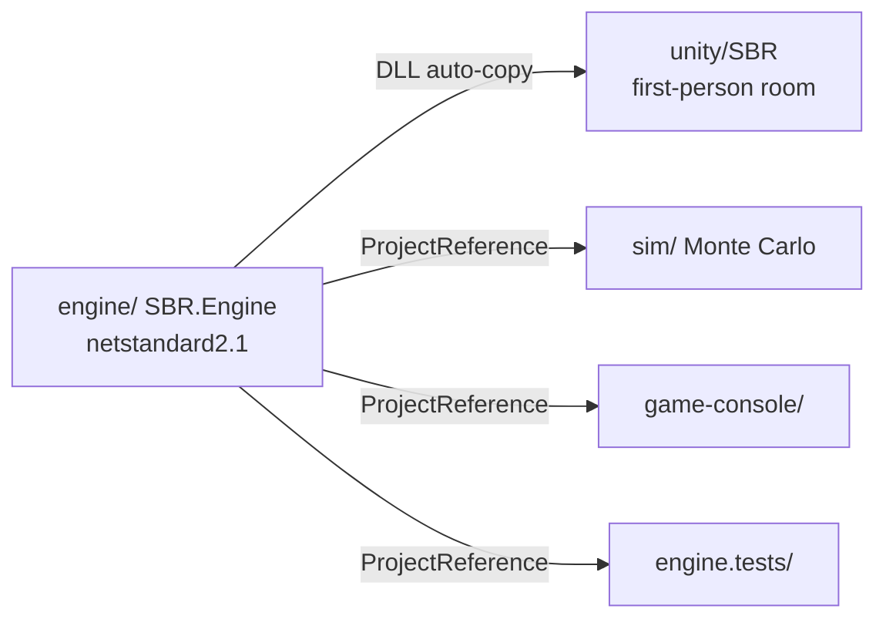
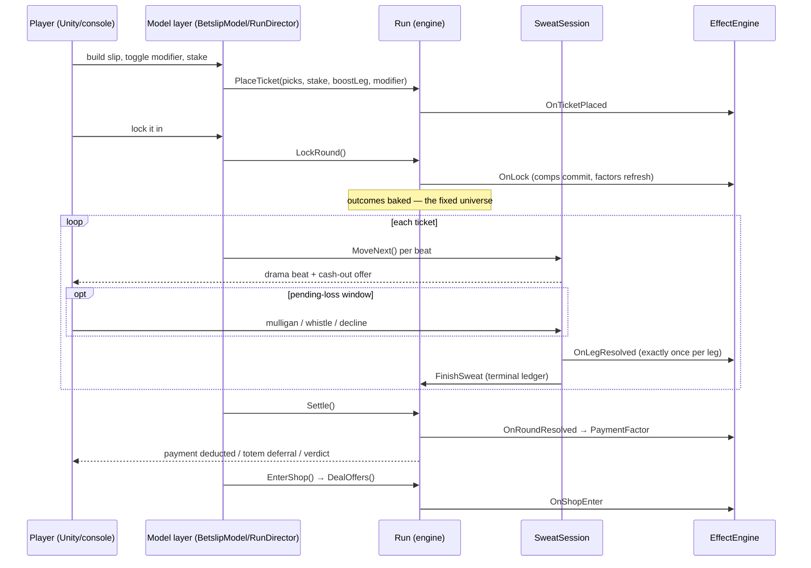
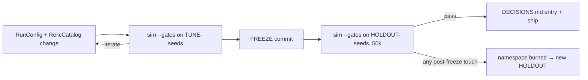

# Sports Betting Roguelite (SBR) — Architecture Documentation

## 1. How to Read This Document

This document describes the **actual architecture** of the SBR codebase for anyone implementing,
reviewing, or testing changes. It is the technical companion to the design bible (`design/00`–`11`,
`DECISIONS.md`): the design docs say *why*; this doc says *how it is built*.

- Sections 2–7 are the universal map (stack, structure, principles, build, config).
- Sections 8–15 are the load-bearing subsystems, ordered by how often a change touches them.
- Sections 16–20 close with cross-cutting concerns (data flow, errors, testing, performance, deployment).

Maintenance rules live in `docs/ARCHI-rules.md`. This doc describes the codebase as of the charm
expansion (playtest #9, 2026-07-16).

## 2. Overview

SBR is a **single-player roguelite about sports betting** (Steam target, satire tone, fictional
leagues). A run is a gauntlet of rounds: place parlay tickets against a vig-priced book, watch them
resolve leg by leg (**the sweat** — the signature moment, with a live cash-out offer), survive an
escalating payment schedule, and build combos from a 22-item catalog of passive charms and
consumables bought with **comps** (a second currency earned by staking).

The architecture is a strict two-layer split plus a balance harness:

1. **`engine/`** — a headless, deterministic, pure-C# game core (no Unity references).
2. **Three presentation/consumer layers** — the Unity 6 first-person room (`unity/SBR`), a text
   console client (`game-console/`), and a Monte Carlo simulation runner (`sim/`).
3. **The sim is a first-class citizen**: every economy change must re-pass a gate campaign (G1–G6)
   plus a per-item audit before it ships. Balance is empirical, not vibes.

## 3. Technology Stack

| Layer | Technology | Version | Notes |
|---|---|---|---|
| Game core | C# / .NET Standard | `netstandard2.1` | Unity/IL2CPP compatible; `Nullable enable`, `LangVersion latest` |
| Tests, sim, console | C# / .NET | `net10.0` | `ImplicitUsings`, `InvariantGlobalization` on the exes |
| Engine unit tests | xUnit | 2.9.3 | + `Microsoft.NET.Test.Sdk` 17.14.1, coverlet |
| Game client | Unity | 6000.5.3f1 (Unity 6) | Scene `Room`; UGUI world-space canvases, all code-built (no art assets yet) |
| Unity tests | Unity Test Framework | EditMode + PlayMode | asmdefs `SBR.Tests.EditMode`, `SBR.Tests.PlayMode` |
| Solution | `SBR.slnx` | — | engine, engine.tests, sim, game-console (Unity project is separate) |
| RNG | PCG32 (custom, `engine/Pcg32.cs`) | — | seeded by FNV-1a 64 hashes of string keys |

No external runtime dependencies in the engine — by decision (2026-07-08): relic content is a C#
catalog, not JSON, because `System.Text.Json` is not in netstandard2.1 and adds IL2CPP friction.

## 4. Project Structure

```
sports-betting-roguelite/
├── engine/                  # SBR.Engine — headless game core (netstandard2.1)
│   ├── Domain.cs            #   Core types: Match, Leg, Ticket, LegGrade, TicketModifier, factor maps
│   ├── Run.cs               #   The run state machine: place → lock → sweat → settle → shop
│   ├── SweatSession.cs      #   Leg-by-leg resolution cursor + live cash-out + pending-loss window
│   ├── DramaGenerator.cs    #   Narrative event authoring toward a pre-sampled outcome
│   ├── DramaEvent.cs        #   Event vocabulary (beats the TV/console render)
│   ├── DramaConfig.cs       #   Pacing dials
│   ├── SlateGenerator.cs    #   Rounds' match slates: teams, records, true probs, offered odds
│   ├── OddsMath.cs          #   Decimal↔American, vig, parlay products, cash-out fair value
│   ├── Pcg32.cs             #   PCG32 + FNV-1a hashing
│   ├── RngHub.cs            #   Named deterministic streams + Derive() for consumable-timing isolation
│   ├── RelicCatalog.cs      #   The 22-item catalog: 15 passives + 7 consumables (ops + params + prices)
│   ├── RelicEffects.cs      #   EffectEngine: the typed hook pipeline + 15 passive behavior classes
│   └── RunConfig.cs         #   Every tuning knob: payments, comps rate, offer counts, prices
├── engine.tests/            # xUnit — 146 tests incl. golden-seed determinism pins
├── sim/                     # SBR.Sim — Monte Carlo harness (exe)
│   ├── Program.cs           #   CLI entry; exit 1 on gate failure OR blocking item flags
│   ├── CliOptions.cs        #   --runs --strategy --gates --grid --audit --combos --seed-prefix --report --verify
│   ├── Harness.cs           #   Batch orchestration over seeds
│   ├── RunPlayer.cs         #   Drives one Run under an IStrategy; audit policies; ItemEvents accounting
│   ├── IStrategy.cs         #   Strategy contract incl. PendingLossAction hook
│   ├── NaiveStrategy.cs     #   naive | random | skilled | noshop | martyr + archetype bots
│   ├── RandomStrategy.cs
│   ├── SkilledStrategy.cs   #   Tier-list buying, engine detection, modifier choice (extensible virtuals)
│   ├── MartyrStrategy.cs    #   Adversarial loss-farmer (G6 worst-case guard)
│   ├── ArchetypeStrategies.cs # ChalkGrinder / VipHoarder / IronHands telemetry bots
│   ├── Metrics.cs           #   Per-round metrics incl. true ticket EV at lock (passive-only + contract)
│   ├── BatchSummary.cs      #   Aggregations across a batch
│   ├── Analysis.cs          #   Gates G1–G6, item flags (DEAD/DOMINANT/UNDEREXPOSED), Bonferroni CIs
│   ├── Stats.cs             #   Paired-seed SEs, z-tests
│   ├── RelicGrant.cs        #   Granted-item counterfactual machinery for audits
│   └── Report.cs            #   Markdown report writer (sim-report-*.md)
├── game-console/            # SBR.ConsoleGame — playable text client (exe)
│   ├── GameLoop.cs BettingScreen.cs SweatRenderer.cs Ui.cs EventText.cs Program.cs
├── unity/SBR/               # Unity 6 project (scene: Room)
│   ├── Assets/Plugins/SBR/  #   SBR.Engine.dll — auto-copied on every engine build
│   ├── Assets/SBR/Runtime/  #   SBR.Game asmdef — all gameplay MonoBehaviours + models (see §14)
│   ├── Assets/SBR/Editor/   #   SBR.Game.Editor asmdef (scene/build tooling)
│   └── Assets/Tests/        #   EditMode/ + PlayMode/ asmdefs
├── design/                  # The design bible (00-vision … 11-charm-expansion)
├── skills/                  # Agent workflows (TRIP-*, codex-*, grill-*, fable-game-director)
├── docs/                    # TRIP workflow docs (this file, plans, changelogs, reviews, tests)
├── DECISIONS.md             # Append-only decision log (the project's constitution)
├── OPEN-QUESTIONS.md        # Parking lot
├── PLAYTESTS.md             # Human playtest log (9 entries)
├── PLAN.md / PLAN-REVIEW-LOG.md  # Current milestone plan + adversarial review record
└── sim-report*.md           # Balance campaign records (tune + holdout validations)
```

## 5. Core Architecture Principles

These are laws, not preferences — each traces to a DECISIONS.md entry:

1. **Headless core.** `engine/` never references Unity. All three consumers drive the same DLL.
   Logic iterates at `dotnet` speed; the editor is never required for a rules change.
2. **Determinism is sacred.** One run seed → identical universe everywhere, forever. All randomness
   flows through `RngHub` named streams; golden-seed tests pin exact outcomes. This enables replay,
   the sim's paired-seed statistics, and the future WebGL parity check.
3. **The fixed universe.** Outcomes are baked at lock time. Presentation (TV, console) only steps a
   cursor — it never consumes engine RNG. Consumable timing never perturbs the universe:
   player-timed actions draw from `RngHub.Derive(round, ticketId, legIndex, action, ordinal)`
   streams that are independent of when (or whether) the player acts.
4. **Locked odds are the contract.** Odds never mutate after lock. Live effects layer *modifiers*
   through the effect pipeline; "store the base, compute the effective" (e.g. House Key's payment
   factor is a getter over the base schedule, never a mutation of it).
5. **Mathematically legible payoff functions** (Pillar 3). Every item maps to the four-number model
   (true p, offered odds, stake, payout) or a tracked accounting quantity, expressible at existing
   hooks and EV-auditable by the sim. Cash-out prices the full remaining payoff function.
6. **One product slot, named factors.** All payout multipliers live in `Ticket`'s factor map
   (`SetFactor`/`RemoveFactor`; `PayoutMultiplier` = the product). No additive stacking ambiguity.
7. **One modifier per ticket.** `TicketModifier` is an enum (None | FreeBet | DoubleOrNothing) —
   locked contract modifiers are mutually exclusive by type.
8. **Sports are not simulated; drama is.** The outcome is sampled first from true p; the
   `DramaGenerator` authors a paced event stream arriving at it. Live probability and cash-out math
   stay honest against the true model.
9. **Effects resolve in acquisition order** through a fixed hook sequence (§12). Stateful passives
   reset on sale.
10. **Docs-first governance.** Design converges in conversation → doc updated → DECISIONS.md entry
    → then code. Economy changes must re-pass the sim gates; holdout seeds are burned if touched
    after a freeze (§13).

## 6. Build System & Toolchain

```bash
dotnet build SBR.slnx                 # engine + tests + sim + console
dotnet test engine.tests              # 146 xUnit tests
dotnet run --project sim -- --gates --runs 50000 --report sim-report.md
dotnet run --project game-console     # playable text client
```

- **The DLL bridge:** `engine/SBR.Engine.csproj` has a `CopyEngineToUnityPlugins` target — every
  engine build copies the fresh DLL into `unity/SBR/Assets/Plugins/SBR/`, guarded on the Unity
  checkout existing so CI/sim-only clones still build. The Unity project can never go stale, and
  Unity scripts compile against the same types the sim tested.
- **Unity** builds through the editor (6000.5.3f1). Batch-mode test runs are the CI surface:
  EditMode + PlayMode via Unity Test Framework. Known quirk: batch exit code 5 with a written XML
  results file is a teardown crash — the XML is authoritative.
- No lint/format tooling is configured; conventions are enforced by review.

## 7. Configuration

- **`engine/RunConfig.cs` is the single tuning surface**: payment schedule
  `[60, 70, 85, 105, 155, 375, 710, 1350]`, comps rate (0.12/$ staked), shop offer counts
  (4 passives + 3 consumables), slot counts, starting bank, juice rate, drama pacing dials
  (per-leg event budgets 3–5 with a progressive-density ramp: 2–4 at round 1 → full band at
  round 3 via `DramaConfig.EventBoundsForRound`, both-branch clamped).
- **`engine/RelicCatalog.cs`** holds per-item params and prices (compile-time C# by decision).
- **Sim CLI flags** (`sim/CliOptions.cs`) select strategy/runs/seeds/campaign mode; seed *prefixes*
  are the namespace mechanism (`TUNE-`, `HOLDOUT-`, …) for the holdout protocol.
- No environment variables, no config files, no per-machine state. Everything reproducible from
  source + seed.

## 8. Engine / Presentation Split

The dependency rule, with the only allowed direction of knowledge:



Presentation layers hold **models** (e.g. Unity's `BetslipModel`, `BookieFeedModel`) that validate
and translate UI intent into engine verbs. The engine exposes state via properties and read-only
snapshots (`EffectStates` for item chrome); it never calls back into a client.

## 9. Game Loop Architecture

A **Run** (`engine/Run.cs`) is a state machine over rounds:

```
new Run(seed) ──► [Round r]
   PlaceTicket(picks, stake, profitBoostLeg, modifier)   × up to 3 tickets
   PlayBookiesMarker / consumables (pre-lock verbs)
   LockRound()          ← comps accrual commits; outcomes baked; odds frozen (the contract)
   [SweatSession per ticket]  ← serial leg-by-leg resolution, cash-out offer live
      FinishSweat()     ← terminal ledger: Free Bet refund exactly-once
   Settle()             ← effective payment = base × PaymentFactor; totem deferral;
                          RoundResolution emitted; win/loss verdict
   EnterShop() / DealOffers()  ← the dealt hand (4 passives + 3 consumables)
   ExitShop() ──► next round … until the payment schedule ends (win) or the bank dies
```

- **`SweatSession`** is a steppable cursor: `MoveNext()` walks drama events; a cash-out offer
  (fair value × (1 − margin) × quote scale) reprices per event; a **pending-loss window** opens
  before a killing event lands, where Mulligan Slip (revert) or Ref's Whistle (grading re-roll at
  the captured pre-kill probability) can save the leg. `OnLegResolved` fires exactly once per leg,
  after the window closes, with the final ticket-local grade.
- **Failure model:** miss a payment → the totem can defer it once (payment × 1.5 onto the next);
  otherwise the run is over. Payments are deducted, not target-checked (economy rework, 2026-07-13).
- The presentation contract: clients render state transitions; they never decide them.

## 10. RNG & Determinism

- **`Pcg32`** streams are created from `(FNV-1a(runSeed), FNV-1a(streamKey))` pairs.
- **`RngHub`** owns named streams (slate, outcomes, drama, relics, shop…) so subsystems cannot
  steal each other's draws.
- **`RngHub.Derive(round, ticketId, legIndex, action, ordinal)`** mints one-off streams keyed by
  `"{round}#{ticketId}#{legIndex}#{action}#{ordinal}"` for player-timed actions (whistle rolls,
  manager redeals) — the reason consumable timing can never perturb the fixed universe.
- **Golden-seed tests** (`engine.tests/GoldenSeedTests.cs`) pin full-run outcomes; any accidental
  draw reordering fails loudly. The same discipline is the future WebGL parity check (backlog).

## 11. The Drama Generator

`DramaGenerator` + `DramaEvent` + `DramaConfig`: the outcome of a leg is sampled **first**; the
generator then authors a beat sequence (momentum swings, near-misses) that *arrives* at it, under
pacing control. `BuildTicketPaths` takes the 1-based round: `DramaConfig.EventBoundsForRound`
implements the progressive-density ramp (design/04 — early sweats shorter, full band by round 3);
the per-leg draw structure is round-independent, only the bounds move (F_0.2.0 M-T1, 2026-07-18 —
an intended drama-stream golden re-pin whose settlement pin proved outcome invariance). Live win-probability shown during the sweat is honest — recomputed from the true
model given revealed beats — so the cash-out offer is always a fair-value quote, never theater
math. Multi-sport support is a reskin because sports are vocabulary, not simulation. The
intervention seam (`ApplyLiveEffect`/`OfferHoldEffect`) survives under test for future live actives
(Timeout used it; playtest #8 cut Timeout, the seam stays).

## 12. Effect Pipeline & Item System

`RelicEffects.cs` is the entity-component analog: `EffectEngine` dispatches to per-item behavior
classes through a **fixed hook order**:

```
OnAcquire → OnSell → OnTicketPlaced → OnLock(run) → OnLegResolved (exactly once/leg)
→ OnBust → OnTicketRealized(ticket, grantComps) → OnRoundResolved(RoundResolution)
→ OnShopEnter (never on a Manager redeal)
plus pull-hooks: CashOutQuoteScale, PaymentFactor, and EffectStat snapshots for UI chrome
```

- **Catalog:** 15 passives (payout engines, ratchets, economy hooks) + 7 consumables (saves,
  boosts, contract modifiers) in `RelicCatalog.cs`. Prices are in comps.
- **Ratchets** (Scar Tissue, Chalk Eater, Iron Hands, Bad Beat Jar, The System) accumulate state
  under precise reset semantics; **selling a stateful passive resets it** (rebuy ≠ resume).
- **Contract modifiers** (Free Bet, Double or Nothing) are locked at placement; Free Bet's refund
  books exactly once via the terminal-realization ledger in `FinishSweat`.
- **Comps are integer deci-comps** internally (`long`, per-round accrual buffer committed at
  LockRound, AwayFromZero) — no float drift in a currency.
- Ask for the Manager is once-per-visit (latch) and redeals via a `Derive` stream —
  ratified KEEP at playtest #9 as a human-agency item (audits ≈0 through bots by design).

## 13. Economy & Balance Simulation

The sim is the project's balance court. `--gates` runs the full campaign:

- **Bots:** naive, random, skilled (tier-list buying, engine detection, modifier choice), noshop,
  martyr (adversarial loss-farmer), plus archetype telemetry bots (ChalkGrinder, VipHoarder,
  IronHands). All implement `IStrategy` including the pending-loss window hook.
- **Gates G1–G6** (`Analysis.cs`): survival shapes for naive/random, skilled win band **5–8% with
  median death ≥5** (re-banded 2026-07-15: dealt-hand build variance is the roguelite shape), EV
  arc crossing on **passive-only counterfactual EV** (G4 amendment), synergy existence (G5),
  martyr worst-case guard on a **granted** batch (G6).
- **Per-item audit:** paired-seed deltas with Bonferroni-corrected CIs; flags DEAD, DOMINANT
  (best − 2× next within kind), UNDEREXPOSED (MinUses 200); declared playtest-gated exemptions
  render as ℹ notes, never blocking. **Exit code 1 on any gate failure or blocking flag.**
- **Holdout protocol:** tune on `TUNE-` seeds → freeze at a named commit → validate once on
  `HOLDOUT-` at 50k runs/batch. Any post-freeze change burns the namespace (HOLDOUT was burned
  once, HOLDOUT2 validated clean — the protocol is honored the hard way).
- Reports are Markdown (`Report.cs` → `sim-report-*.md`) and are the of-record artifacts cited by
  DECISIONS.md.

## 14. Unity Presentation Layer

Scene `Room`: a compact first-person apartment where **the room is the interface** (design/08):

- **Player & interaction:** `FirstPersonController` (invisible character), `PlayerInteractor` +
  `Interactable` + `InteractionHud` (crosshair/prompt loop), `SitSpot` (couch sit = seated zoom,
  clamped look), `CameraGlide` + `DeskFocus` (claim-before-glide camera ownership for desk surfaces).
- **The TV** (`TvSweatScreen` + `TvLight`): the sweat surface — world-space UGUI, serial ticket
  sweats, the pending-window beat (`[M]ulligan / [R]eview / let it die`), slip strip, settle cards.
  `TvLight` makes the room the reaction shot (palette law: green money-good, red money-bad, gold
  cash-out — colors reserved).
- **The match theater** (F_0.2.0, the sweat's renderer — a stage, never a simulation):
  `TvSweatScreen` orchestrates; `SweatPresentationModel` (pure C#: beat history + deltas, the
  direction rule, `TheaterPalette` team colors from a non-reserved pool, `ScoreLedger` — causal
  score synthesis with the ±1 live-lead clamp, playback-completion commits, and the playtest #14
  prob-reconciliation source: the scoreboard is a lagging quantized rendering of the live prob);
  `TheaterChoreographer` + `ScenePlaybook` (the ordered beat→scene resolver, 15 templates, total
  over all combos) + `SweatPacer` (scene-class durations × `paceMultiplier`, the 60–90s duration
  law); `TheaterStage` (neon pitch, actor-routed ball with sticky possession, per-dot movement
  personalities, defensive engagement, scene playback with onReveal payoff callbacks and the
  frozen kill-shot suspension); `MomentumTape` (per-leg beat strips → money-signal caps);
  `PitchLayout` (formation geometry). Causal reveal law: chrome, tape, and market reprice at the
  scene's payoff — dangerous scenes suspend the market until then (the shown price is always the
  paid price).
- **Audio v0** (`TvAudioDirector`, M-T5): procedural, diegetic, zero-asset — all clips synthesized
  at build (filtered-noise crowd bed on its own low-passed child object; goal/chalked, near-miss
  riser-and-cut, whistle, GREEN/DEAD slams, cash-out ka-chunk stings). Tension-driven (win-prob
  distance from 0.5 + scene urgency), with the dread floor: the pending window and stand-up duck
  everything to near-silence. Strictly parallel decoration — never blocks a scene; batch-safe.
- **The laptop** (`LaptopScreen` + `BetslipModel` + `RunDirector`): the betting app — betslip with
  fraction-chip stakes and modifier toggles, shop (dealt-hand cards, Manager button, sell-backs at
  `GetResaleValue`), run header with effect chrome. `RunDirector` owns run lifecycle and engine
  verb calls.
- **The phone** (`PhoneScreen` + `BookieFeed(Model)` + `BookieScript`): the bookie's voice — a
  deterministic text thread keyed by trigger kinds; `BookieFeedModel.CliffRatio` (1.45) decides
  when the schedule growls.
- **`OddsFormat`**: American odds display only; the engine stays decimal.
- Rendering is deliberately graybox: code-built UGUI, no asset pipeline yet (Phase 2 gate is feel,
  not art). Audio is procedural v0 (above); the CC0-vs-procedural decision belongs to the slice
  feel gate.

## 15. Console Client

`game-console/` is the fastest full-loop playtest surface (`dotnet run --project game-console`):
`GameLoop` (run/shop/Manager), `BettingScreen` (picks, stakes, `[K]` marker, `[F]/[D]` modifier
prompts), `SweatRenderer` (drama beats, save-window prompts with review %), `Ui`/`EventText`
(rendering vocabulary). It exercises every engine verb the Unity room does — new engine features
land here first.

## 16. Data Flow Diagrams

The round loop across layers:



The balance loop:



## 17. Error Handling Strategy

- **Engine:** guard clauses throw on illegal verbs (placing after lock, over-slot buys, double
  modifiers); `PlaceTicket` validates atomically (no partial state on rejection). Illegal states
  are unrepresentable where types allow (enums for grades/modifiers, factor maps over ad-hoc
  multipliers).
- **Sim:** CLI parse errors print usage and exit non-zero; the campaign exits 1 on gate failure or
  blocking flags so CI/scripts can gate on it.
- **Clients:** models pre-validate so engine exceptions are programmer errors, not player-reachable
  states; the console prints friendly rejections.
- No logging framework; the sim report is the observability surface that matters.

## 18. Testing Strategy

| Suite | Framework | Count | What it pins |
|---|---|---|---|
| `engine.tests/` | xUnit | 146 | Behavior matrix per item, worked-number pins, golden seeds, determinism, catalog invariants |
| Unity EditMode | UTF | 32 | Model logic (odds format, betslip, bookie feed triggers) |
| Unity PlayMode | UTF | 8 | Room wiring, screen flows |
| `sim --gates` | custom | statistical | The economy itself: G1–G6 + item flags on 50k-run batches |

Conventions: tests pin **tuned values** (a tuning change is a test change — deliberate friction);
golden-seed tests catch draw-order regressions; the sim is the regression suite for balance, run
before any economy-touching merge. Known quirk: Unity batch exit 5 with XML written = teardown
crash; trust the XML.

## 19. Performance Considerations

- The engine allocates modestly and runs ~millions of rounds/hour in the sim — the sim's 7.55M-run
  holdout is the de facto perf benchmark; keep hot paths (sweat stepping, effect dispatch)
  allocation-light.
- Integer deci-comps avoid float accumulation costs and drift.
- Unity layer is graybox UGUI — no perf work warranted until the art pass.
- Long sim runs on Windows: detach via PowerShell `Start-Process` (msys `nohup` dies with the
  parent shell).

## 20. Deployment

- **Now:** engine/sim/console via `dotnet run`; Unity through the editor (play mode) for playtests.
- **Backlog:** WebGL build + golden-seed determinism check (early Phase 2 item); Steam packaging
  and Steamworks wrapper decision parked to Phase 3.
- No CI pipeline exists yet; the gate discipline (tests + sim campaign) is enforced by workflow.

## 21. Conclusion

SBR's architecture is three decisions compounding: a **headless deterministic core** (so logic
iterates at CLI speed and three consumers share one truth), a **fixed-universe RNG discipline**
(so replay, honest cash-out math, and paired-seed statistics are all free), and an **empirical
balance court** (so the economy ships with evidence, not intuition). The effect pipeline's typed
hooks and single-product-slot law keep a 22-item (soon 150+) catalog composable without stacking
ambiguity. The room is the interface; the engine is the game.
