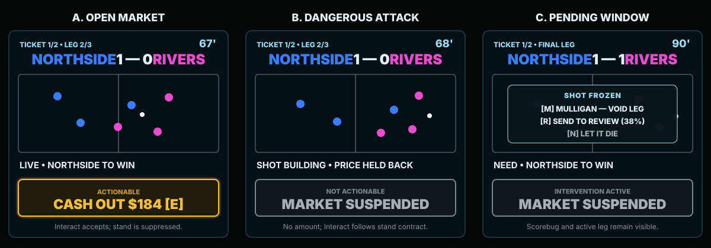

# TV Sweat Refinement Visual Design

**Status:** Layout APPROVED 2026-07-25 (Layout B, §2). Visual world replaced — see §4 note.  
**Review mode:** View from the in-room couch with master audio muted  
**Reference canvas:** 980 × 550, matching the current world-space TV canvas  
**Implementation status:** No production UI change has been made

## 1. Design intent

The screen should read like a restrained live sportsbook broadcast:

- the top tells you the match truth;
- the center shows the event;
- the right rail tells you what your bet needs;
- the bottom tells you what your money is doing;
- the event line explains the latest price move without becoming the headline.

The theater remains visually important, but it is not allowed to push the bet requirement,
risk/payout, or cash-out state into tiny text.

## 2. Live layout — Layout B, "Ticket Rail" (APPROVED 2026-07-25)

Allen selected Layout B from five greybox concepts in
[visuals/layout-concepts.html](visuals/layout-concepts.html). The previously proposed right-rail
layout is **not** adopted; `visuals/tv-sweat-live.svg` is superseded and retained only as history.

**The reasoning, recorded because it constrains everything downstream:** reading starts at the left.
Putting the ticket there means the first thing the eye lands on is the bet, which is what the product
is actually about. The match is what the bet is *made of*, not the subject.

### Structure

```text
┌──────────────┬────────────────────────────────────────┐
│              │  COMPACT SCOREBUG    teams · score · clock
│  TICKET      ├────────────────────────────────────────┤
│  COLUMN      │                                        │
│              │        THEATER STAGE                   │
│  all legs    │        fixed top-down                  │
│  stacked     │        picked team attacks right       │
│              │                                        │
│  active leg  │                                        │
│  expanded:   │                                        │
│  NEED        │                                        │
│  LIVE        ├────────────────────────────────────────┤
│              │  EVENT STRIP                           │
│  RISK / PAYS │                                        │
├──────────────┴────────────────────────────────────────┤
│  CASH-OUT / ACTION SLOT                               │
└───────────────────────────────────────────────────────┘
```

### Zone rules

| Zone | Position | Purpose |
|---|---|---|
| Ticket column | Full-height left | Every leg visible at once, active leg expanded with market/odds/`NEED`/`LIVE`. Risk and payout at its foot. Owns questions 3 and 4. |
| Compact scorebug | Top of the right region | Teams, score, clock, ticket/leg index. Questions 1 and 2. |
| Theater stage | Right region, below the scorebug | Wider than the old layout because no right rail competes with it. |
| Event strip | Below the stage | Question 6. Never covers the pitch. |
| Cash-out / action slot | Anchored at the foot of the ticket column | Money and action live together. Question 5. |
| §8.8 stats panel | Second tab at the head of the ticket column | Freezes playback when opened. |

The ticket column is stable. It does not resize between markets, and the active leg occupies the
same slot within it on every leg so the player never searches for the requirement.

**Carried risk to watch in build:** the composition is left-heavy while the picked team attacks
right, so the eye starts at the ticket and the payoff lands at the far edge. Two consequences to
verify in the couch review — the attacking goal is unobstructed, which is good, but a payoff moment
may need to pull the eye rightward deliberately rather than assuming it is already there.

## 3. Typography

The implementation may continue using the current available font, but the visual hierarchy is
fixed:

| Role | Reference size | Treatment |
|---|---:|---|
| Score numerals | 36 px | Bold, white |
| Team names | 27–30 px | Bold, theater team color |
| Clock | 28 px | Bold, cyan/white |
| Active `NEED` statement | 27–30 px | Bold, white |
| Active live progress | 22–24 px | Bold; neutral unless resolved |
| Cash-out amount/action | 28–30 px | Bold, gold when actionable |
| Risk/payout | 23–25 px | Bold, white/gold labels |
| Event strip | 21–23 px | Medium/bold, neutral broadcast white |
| Leg chips | 18–20 px minimum | Bold |
| Eyebrows/system labels | 14–16 px | Uppercase, tracked, subdued |

Primary sweat information may not use the current 15 px slip-strip scale. System chrome may remain
small because it is not required for moment-to-moment comprehension.

Text rules:

- No horizontal overflow for required information.
- Team names may abbreviate through the existing short-name rule.
- The `NEED` statement may wrap to two lines; nothing else in the right rail should wrap.
- Event copy truncates or chooses a shorter authored line rather than shrinking.

## 4. Color and semantic rules

> **SUPERSEDED 2026-07-25.** `design/08-art-direction.md` is deprecated and the visual world is being
> replaced with a stadium-LED language in an expensive-and-slick register. The palette below was
> derived from the old casino-neon world and **no longer binds**. The colour-purity rule (green/red
> for money only) was explicitly released by Allen and is not carried forward by default.
>
> The table is retained for one reason: the *semantic distinctions* it draws are still correct even
> though its values are not. Money-good, money-bad, actionable, suspended, void, and team identity
> must all remain distinguishable — the new brand book decides with what.
>
> `DESIGN.md` owns the replacement tokens.

| Token | Hex for mockup | Meaning |
|---|---|---|
| Screen black | `#040807` | Base |
| Panel black-blue | `#071015` | Cards and scorebug |
| Neutral line | `#1D343F` | Structure |
| Broadcast white | `#E7F1F5` | Primary neutral information |
| Chrome cyan | `#9EDCF6` | Clock, labels, neutral broadcast chrome |
| Money good | `#3CE873` | Won/green only |
| Money bad | `#FF4038` | Lost/dead only |
| Cash-out gold | `#F2BC45` | Actionable cash-out and payout only |
| Pending gray | `#7A878F` | Suspended/unavailable |
| Team blue | `#3D7BFF` | Team identity |
| Team magenta | `#E84DD0` | Team identity |

Rules:

- A backed-team pill uses that team’s identity color, not money green.
- Live progress is neutral until the leg resolves; “leading” is not the same as “won.”
- Suspended is gray, never cyan (cyan remains Void).
- Event copy remains neutral even when the event helps or hurts. The price and leg outcome surfaces
  carry the money semantics.

## 5. Scorebug

Structure:

```text
TICKET 1/2 • LEG 2/3   [TEAM • BACKED]   1 — 0   [OPPONENT]       67'
```

- Score is visually central.
- Backed identity is explicit for moneyline.
- For totals, BTTS, corners, cards, and scorer props, the scorebug shows both team identities but
  no fake backed-team marker. The right rail uses `MARKET PICK`.
- Season records leave the live scorebug. They can appear on a pregame/ticket card if retained.
- PRE, live minutes, stoppage, and FT occupy the same clock rectangle.

## 6. Active-leg card

### Moneyline

```text
YOUR ACTIVE LEG
MONEYLINE  +135

NORTHSIDE TO WIN

LIVE • LEADING 1–0
[blue dot] BACKED TEAM
```

### Total goals

```text
YOUR ACTIVE LEG
TOTAL GOALS  -110

OVER 2.5 GOALS

LIVE • 2 GOALS • 1 MORE
MARKET PICK
```

Under example: `LIVE • 2 GOALS • LIMIT 2`.

### Both teams to score

```text
YOUR ACTIVE LEG
BTTS — YES  -105

BOTH TEAMS TO SCORE

LIVE • 1/2 TEAMS SCORED
MARKET PICK
```

BTTS No uses `KEEP ONE TEAM SCORELESS`; it must not claim success before FT.

### Corners or cards

```text
YOUR ACTIVE LEG
TOTAL CORNERS  +100

OVER 8.5 CORNERS

LIVE • 7 CORNERS • 2 MORE
MARKET PICK
```

Cards uses the same pattern and the revealed card total.

### Anytime scorer

```text
YOUR ACTIVE LEG
ANYTIME SCORER  +210

MARCUS VALE TO SCORE

LIVE • WAITING FOR VALE
[team-color dot] NORTHSIDE
```

`VALE SCORED` appears only at the scorer identity payoff. A generic earlier goal cannot flip this
copy.

## 7. Event strip

The event strip is explanation, not commentary theater.

Good:

- `NORTHSIDE SWITCH THE PLAY — CUTBACK BLOCKED`
- `VALE FINDS THE NET`
- `CORNER TO RIVERS • +2 IN THE SPELL`
- `VAR — NO GOAL`

Avoid:

- duplicate score or win percentage;
- two unrelated clauses;
- green/red emotional copy;
- a corner/booking/scorer name that the revealed facts do not support;
- a line that appears before the visual payoff.

The strip punches once at reveal, then returns to rest. Its lifetime freezes on stand.

## 8. Cash-out and intervention states



### Open

- Gold outline/fill accent.
- `CASH OUT $184  [E]`.
- Interact is reserved for acceptance.
- Amount animation and acceptance cannot overlap.

### Updating

- Same geometry.
- `CASH OUT $176  •  UPDATING`.
- Interact is not reserved until the visible amount and accepted amount agree.

### Suspended

- Neutral gray.
- `MARKET SUSPENDED`.
- No amount is shown.
- Interact follows the normal stand contract; it must not be swallowed as a cash-out attempt.

### Pending Mulligan / Whistle

- The shot remains frozen on the pitch.
- A small overlay sits inside the theater safe area.
- Cash-out slot remains `MARKET SUSPENDED`.
- Options are plain and distinct:
  - `[M] MULLIGAN — VOID LEG`
  - `[R] SEND TO REVIEW (38%)`
  - `[N] LET IT DIE`
- The scorebug and active-leg card remain visible.

### Accepted

- `CASHED OUT $184` in gold.
- Stage stops without committing an unfinished payoff.
- Ticket settlement follows; prior offer cannot reappear.

## 9. Ticket and settlement states

### Ticket interstitial

The stage and active-leg card clear before the card appears:

```text
TICKET 2 OF 2

NORTHSIDE ML +135  •  OVER 2.5 -110  •  VALE ANYTIME +210

RISK $50                         PAYS $462
```

No score, clock, tape, event line, suspended label, or offer from the prior ticket remains.

### Leg resolution

- The on-pitch final payoff completes.
- Score/count callback lands.
- Clock reaches FT.
- Active leg resolves to W/L/VOID.
- Leg chip changes to its money signal.
- GREEN/DEAD/VOID ceremony plays.
- Only then may ticket settlement begin.

### Ticket settlement

- Win: payout amount owns the stage area; risk/payout row remains stable.
- Loss: restrained dim and consolation; no stale cash-out action.
- Cash-out: accepted amount owns the stage area.
- After the beat, the next ticket card starts from a cleared state.

### Round settlement

Begins only after the final ticket settlement. It may reuse the full-screen card treatment but
must not resemble an active leg or cash-out offer.

## 10. Theater movement design

The camera remains fixed. Scene variation is visible through:

- where possession begins;
- how the ball progresses;
- how wide or narrow the attacking shape becomes;
- whether defenders press, track, drop, or recover;
- the final pass/shot shape;
- the factual payoff and reactions.

### Grammar silhouettes

| Grammar | Couch-readable silhouette |
|---|---|
| Central buildup | compact triangles through the middle; defense narrows |
| Wing progression | carrier and support overload one touchline; defense shifts laterally |
| Switch of play | pressure draws to one side, then one long diagonal transfer opens the far side |
| Counterattack | visible turnover, stretched lines, two supporting runners, recovering chase |
| Set piece | brief static setup, synchronized runs, singular delivery |

### Payoff silhouettes

| Shape | Required visual distinction |
|---|---|
| Through ball | runner crosses the back line before the final touch |
| Cross | delivery originates wide and enters the goal area laterally |
| Cutback | ball reaches the byline, then travels backward to the shooter |
| Rebound | first shot visibly blocked/saved; a different second touch completes the fact |
| Block | defender enters the shot path; ball remains in play unless a corner fact exists |
| Interception | defender wins a pass before the shot; possession visibly changes |
| Keeper save | keeper lunges to the ball; score remains unchanged |
| Clearance | defender sends the ball out of danger; no corner marker unless one exists |
| Post | ball contacts the frame and deflects away; no goal flash |
| Near wide | ball passes outside the post; no keeper contact required |
| Near-post corner | delivery and first contact occur at the near edge of the goal area |
| Far-post corner | delivery crosses the face before contact |
| Cleared corner | defender wins first contact and pushes the block outward |

The planner chooses only combinations permitted by the factual `SceneSpec`.

## 11. Motion timing

- Preserve the existing overall pacing law unless the audit proves a reliability defect.
- Movement changes are authored inside the scene’s current duration budget.
- Dangerous payoff occurs with enough tail for the reopened cash-out state to be seen.
- UI transitions use short restrained motion:
  - score/count punch: 120–180 ms;
  - event-strip entrance: 120–180 ms;
  - active-leg progress change: 180–240 ms;
  - ticket crossfade/slide: 300–450 ms;
  - action-state change: immediate label swap plus 120–180 ms color settle.
- Standing freezes tween progress exactly.
- No camera shake, cut, or zoom is required.

## 12. Couch-readability review

Run with the real seated camera and audio muted:

1. Look away for five seconds, look back, and name the backed team/market.
2. Read score and time without leaning forward.
3. State what the leg needs in under three seconds.
4. State risk and payout.
5. Identify whether cash-out is actionable without pressing a key.
6. Explain the last price move from the event strip.
7. Watch two consecutive scenes and describe how their movement differed.

Failure of questions 1–5 is major. Failure of 6–7 is at least polish and blocks the refinement
quality gate unless explicitly deferred.

## 13. Sign-off checklist

- [ ] Fixed stage + active-leg rail layout approved.
- [ ] Typography hierarchy approved.
- [ ] Backed-team versus market-pick treatment approved.
- [ ] Cash-out/open/suspended/pending treatments approved.
- [ ] Market-specific `NEED` and `LIVE` copy approved.
- [ ] Fixed-camera ruling approved.
- [ ] Ticket and settlement transition order approved.
- [ ] Review will be performed muted; audio remains deferred.

